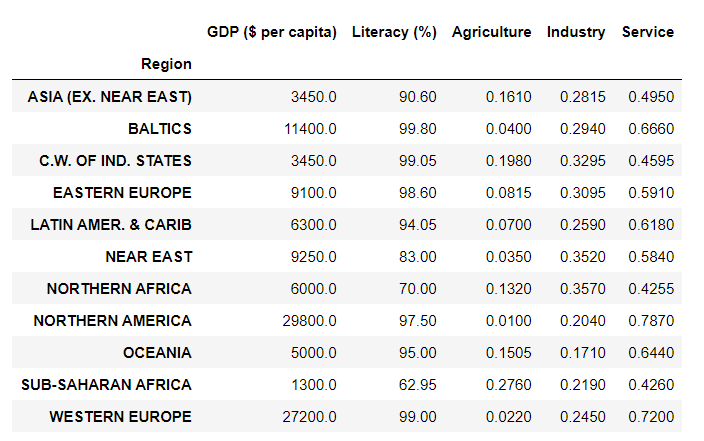
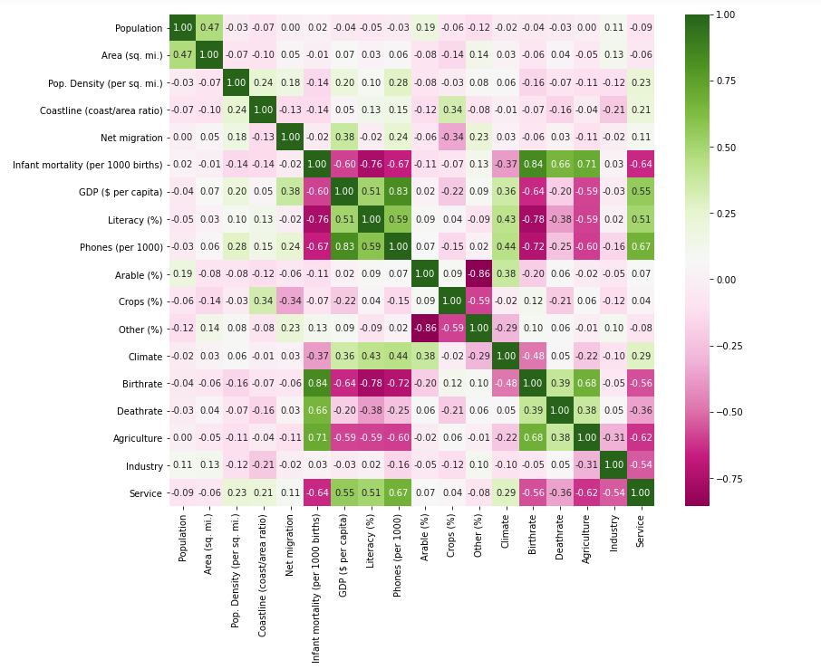

# Analysis

We observed that the table is missing certain information. We'll fill in the missing data with the median of the region that a country belongs to because countries that are geologically adjacent are often similar in many aspects. Let's look at the region medians for 'GDP ($ per capita),' 'Literacy (percent),' Agriculture, Industry, and Service,' for example. Note that we use the mode instead of the median for 'climate' because it appears that 'climate' is a categorical feature here.

 
Here we need to show the correlation between all numerical columns. So, here we using Seaborn and Seaborn is a data visualization library that is built on top of matplotlib and contains a direct function to create heatmaps. The heatmap shows the correlation between all numerical columns.

