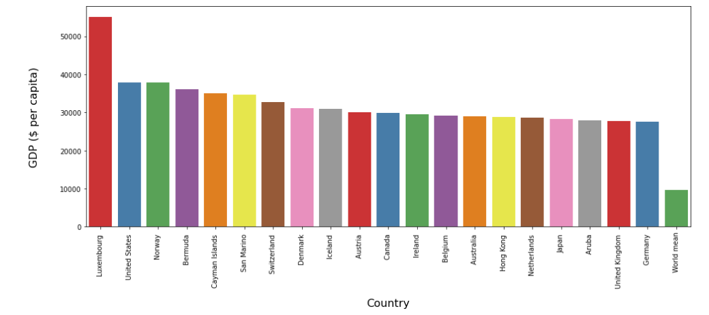
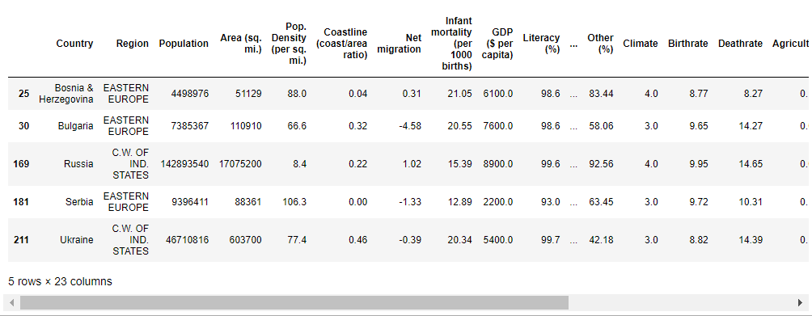
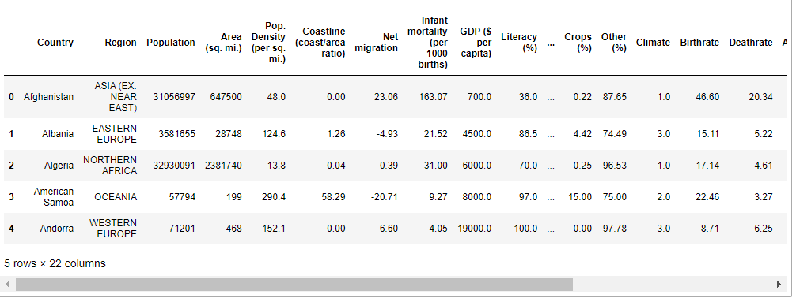

# Analysis
## Data Preparation – fill in missing values
We observed that the table is missing certain information. We'll fill in the missing data with the median of the region that a country belongs to because countries that are geologically adjacent are often similar in many aspects. Let's look at the region medians for 'GDP ($ per capita),' 'Literacy (percent),' Agriculture, Industry, and Service,' for example. Note that we use the mode instead of the median for 'climate' because it appears that 'climate' is a categorical feature here.

## Data Exploration & Visualisation
### Correlation between Variables
Here we need to show the correlation between all numerical columns. So, here we using Seaborn and Seaborn is a data visualization library that is built on top of matplotlib and contains a direct function to create heatmaps. The heatmap shows the correlation between all numerical columns.

### Top Countries with the highest GDP per capita.
In this bar chart top 20 countries with the highest GDP per capita. Luxembourg's GDP per capita is around $55000. Luxembourg is higher than the next 19 conuntries, the next 19 countries are close. Germany, the 20th has about 2.5 times GDP per capita of the world average.

### Countries with low Birthrate and low GDP per capita
A few highlights, similar to phones, are connected with the average GDP all the more straightly, while others are not. For instance, High birthrate generally low GDP per capita, however normal GDP in low birthrate countries can change a lot. 
Let’s look at the countries with low birthrate (< 10%) and low GDP per capita (< 10000$). They also have high literacy, like other high average GDP countries. But we hope their other features can help distinguish them from those with low birthrate but high average GDPs, like service, are not quite an important portion in their economy, not a lot phone procession, some have negative net migration. We can see 5 countries (Bosnia & Herzegovina, Bulgaria, Russia, Serbia and Ukraine) here low birthrate and also low GDP per capita from eastern Europe or C.W. of IND. STATES, so the ‘region’ feature may also be useful.

## Training and Testing
First label encoding the categorical features ‘Region’ and ‘Climate’, and we will just use all features given in the data set without further feature engineering.

